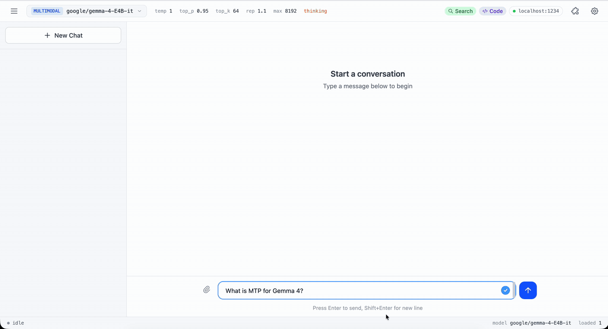

<a name="top"></a>
<h1 align="center">inference.rs</h1>

<p align="center"><b>Fast, flexible LLM inference.</b></p>

<p align="center">
  | <a href="https://github.com/christopherthompson81/inference.rs/blob/master/docs/src/content/docs/index.mdx"><b>Documentation</b></a> | <a href="https://github.com/christopherthompson81/inference.rs/blob/master/docs/src/content/docs/quickstart.mdx"><b>Quickstart</b></a> | <a href="https://github.com/christopherthompson81/inference.rs/blob/master/docs/src/content/docs/reference/supported-models.md"><b>Supported models</b></a> | <a href="https://github.com/christopherthompson81/inference.rs/blob/master/docs/src/content/docs/guides/rust/getting-started.mdx"><b>Rust SDK</b></a> | <a href="https://github.com/christopherthompson81/inference.rs/blob/master/docs/src/content/docs/guides/python/getting-started.mdx"><b>Python SDK</b></a> |
</p>

<p align="center">
  <a href="https://github.com/christopherthompson81/inference.rs/stargazers">
    
  </a>
</p>

## About this fork

**inference.rs** is a fork of [mistral.rs](https://github.com/EricLBuehler/mistral.rs) by Eric Buehler, renamed because
it is not limited to particular model types: it adds non-LLM models (starting with the PP-DocLayoutV3 document layout
detector in `inference-layout`) and a C ABI for bindings in other languages. All credit for the engine it builds on goes
to upstream; see [LICENSE](LICENSE) and [CITATION.cff](CITATION.cff).

Names differ from upstream: crates are `inference-*` (the Rust SDK is `inference`), the CLI binary is `inference`, the
Python package is `inference_rs`, and environment variables use `INFERENCE_RS_*`. Documentation links below go to the
docs sources in this repository.

## Latest

- **Muse Glimmer 30B**: native text, image, and video inference with ATEM tool calling, reasoning controls, LoRA, ISQ/UQFF, and companion-projector GGUF loading. [Model notes](https://github.com/christopherthompson81/inference.rs/blob/master/docs/src/content/docs/guides/models/model-family-notes.mdx#muse-glimmer)
- **GGUF loading**: load a local file with `-f`, or select a published artifact with `--quant`. Tokenizer, configuration, and multimodal projector files are discovered when the available metadata identifies them unambiguously. [Guide](https://github.com/christopherthompson81/inference.rs/blob/master/docs/src/content/docs/guides/models/run-gguf.mdx)
- **OpenAI-compatible Skills**: upload `/v1/skills` bundles and reference them from Responses requests for reusable procedures, helper scripts, and local data. [Guide](https://github.com/christopherthompson81/inference.rs/blob/master/docs/src/content/docs/guides/agents/skills.mdx)
- **OpenAI-compatible file inputs**: upload `/v1/files`, attach Responses `input_file` or Chat `file` parts, and mount request files into shell/code sessions. [Guide](https://github.com/christopherthompson81/inference.rs/blob/master/docs/src/content/docs/guides/agents/file-inputs.mdx)
- **DiffusionGemma**: block-diffusion text generation. Fully integrated: paged attention, prefix caching, ISQ, multimodal, and tool calling. [Guide](https://github.com/christopherthompson81/inference.rs/blob/master/docs/src/content/docs/guides/models/use-block-diffusion.mdx)
- **Anthropic Messages API**: `inference serve` now exposes Anthropic-compatible `/v1/messages` and `/v1/messages/count_tokens` endpoints alongside the OpenAI-compatible `/v1` API. [Guide](https://github.com/christopherthompson81/inference.rs/blob/master/docs/src/content/docs/guides/serve/anthropic-messages-api.md)
- **Agentic runtime**: web search, local Python code execution, shell execution, OpenAI-compatible Skills, session management, and custom tool hooks. [Guide](https://github.com/christopherthompson81/inference.rs/blob/master/docs/src/content/docs/guides/agents/index.md)
- **Gemma 4**: full multimodal: text, image, video, and audio input. [Supported models](https://github.com/christopherthompson81/inference.rs/blob/master/docs/src/content/docs/reference/supported-models.md) | [Video setup](https://github.com/christopherthompson81/inference.rs/blob/master/docs/src/content/docs/guides/models/video-setup.md)

## Why inference.rs?

- **Automatic model loading**: Architecture, weight format, and chat template are detected for supported Hugging Face models and GGUF files, with flags available for explicit selection.
- **True multimodality**: Text, vision, video, and audio, speech generation, image generation, and embeddings in one engine.
- **Quantization selection**: `--quant` selects a matching artifact from GGUF repositories. For other Hugging Face repositories, it uses a prebuilt UQFF when available and otherwise applies ISQ. [Docs](https://github.com/christopherthompson81/inference.rs/blob/master/docs/src/content/docs/guides/quantization/quantize-a-model.mdx)
- **OpenAI + Anthropic compatible serving**: The same `inference serve` process exposes OpenAI-compatible `/v1` endpoints and Anthropic-compatible Messages endpoints.
- **Prometheus metrics**: `inference serve` exposes a `/metrics` endpoint in Prometheus format, recording per-request counts and latency labeled by method, route, and status. [Docs](https://github.com/christopherthompson81/inference.rs/blob/master/docs/src/content/docs/reference/http-api.md)
- **Built-in web UI**: Served at `/ui` by default. Shows reasoning, code execution, plots, and files inline. Edit any message and the new branch runs with its own Python state. Pass `--no-ui` to disable.
- **Hardware-aware**: `inference tune` recommends quantization and device mapping from the model config and your detected hardware.
- **Flexible SDKs**: Python package and Rust crate to build your projects.
- **Native agentic support**: built-in [agentic loop](https://github.com/christopherthompson81/inference.rs/blob/master/docs/src/content/docs/guides/agents/index.md) with web search, local Python code execution, shell execution, OpenAI-compatible Skills, session management, and custom tool hooks.

## Quick Start

### Install

**Linux/macOS:**
```bash
curl -fsSL https://raw.githubusercontent.com/christopherthompson81/inference.rs/master/install.sh | sh
```

**Windows (PowerShell):**
```powershell
irm https://raw.githubusercontent.com/christopherthompson81/inference.rs/master/install.ps1 | iex
```

Downloads a self-contained prebuilt binary for your platform (Metal on Apple Silicon; per-GPU CUDA or CPU on Linux; CPU on Windows), falling back to a source build if none matches. Standard acceleration needs no Rust or CUDA toolkit. Optional cuTile acceleration requires NVIDIA's separately installed `tileiras` tool.

[Manual installation, accelerator details & other platforms](https://github.com/christopherthompson81/inference.rs/blob/master/docs/src/content/docs/quickstart.mdx)

### Run Your First Model

```bash
# Interactive chat
inference run -m Qwen/Qwen3-4B

# One-shot prompt (no interactive session)
inference run -m Qwen/Qwen3-4B -i "What is the capital of France?"

# One-shot with an image
inference run -m google/gemma-4-E4B-it --image photo.jpg -i "Describe this image"

# Run a local GGUF or select a published 4-bit GGUF
inference run -f /path/to/model.gguf
inference run -m unsloth/Qwen3.5-4B-GGUF --quant 4

# Agentic REPL: search + code execution + shell from the terminal
inference run --agent -m Qwen/Qwen3-4B

# Start an API server with the built-in web UI
inference serve -m google/gemma-4-E4B-it
```

For the server command, visit `http://localhost:1234/ui` for the web chat interface. OpenAI-compatible clients use `http://localhost:1234/v1`; Anthropic-compatible clients use `http://localhost:1234`.

### The `inference` CLI

The CLI uses the same `run`, `serve`, and `bench` commands for model repositories, local directories, and GGUF files.

- **Auto-detection**: Automatically detects model architecture, quantization format, and chat template
- **All-in-one**: Single binary for chat, server, benchmarks, and web UI (`run`, `serve`, `bench`)
- **Hardware-aware tuning**: `inference tune` recommends quantization and device mapping for your model and hardware
- **Model formats**: Hugging Face checkpoints, [GGUF files](https://github.com/christopherthompson81/inference.rs/blob/master/docs/src/content/docs/guides/models/run-gguf.mdx), and [UQFF quantizations](https://github.com/christopherthompson81/inference.rs/blob/master/docs/src/content/docs/reference/uqff-format.md)

```bash
# Recommend settings for your hardware and emit a config file
inference tune -m Qwen/Qwen3-4B --emit-config config.toml

# Run using the generated config
inference from-config -f config.toml

# Diagnose system issues (CUDA, Metal, Hugging Face connectivity)
inference doctor
```

[Full CLI documentation](https://github.com/christopherthompson81/inference.rs/blob/master/docs/src/content/docs/reference/cli/index.md)

<details open>
  <summary><b>UI Demo</b></summary>
  <br>
  
</details>

## What Makes It Fast

**Performance**
- Continuous batching support by default on all devices.
- CUDA with FlashAttention V2/V3, Metal, and [multi-GPU/distributed inference](https://github.com/christopherthompson81/inference.rs/blob/master/docs/src/content/docs/guides/perf/distributed-inference.mdx)
- [PagedAttention](https://github.com/christopherthompson81/inference.rs/blob/master/docs/src/content/docs/guides/perf/paged-attention.mdx) for high throughput continuous batching on CUDA or Apple Silicon, prefix caching (including multimodal)

**Quantization** ([full docs](https://github.com/christopherthompson81/inference.rs/blob/master/docs/src/content/docs/reference/quantization-types.md))
- [In-situ quantization (ISQ)](https://github.com/christopherthompson81/inference.rs/blob/master/docs/src/content/docs/guides/quantization/quantize-a-model.mdx) for Hugging Face models
- [GGUF](https://github.com/christopherthompson81/inference.rs/blob/master/docs/src/content/docs/reference/gguf-support.md) (2-8 bit), GPTQ, AWQ, HQQ, FP8, BNB support
- ⭐ [Per-layer topology](https://github.com/christopherthompson81/inference.rs/blob/master/docs/src/content/docs/guides/perf/topology.mdx): Fine-tune quantization per layer for optimal quality/speed
- ⭐ Auto-select fastest quant method for your hardware

**Flexibility**
- [LoRA](https://github.com/christopherthompson81/inference.rs/blob/master/docs/src/content/docs/guides/customize/lora-adapters.mdx) with per-request adapter selection and live hot-swapping
- AnyMoE: Create mixture-of-experts on any base model
- [Multiple models](https://github.com/christopherthompson81/inference.rs/blob/master/docs/src/content/docs/guides/serve/multiple-models.mdx): Load/unload at runtime

**Agentic Features**
- Integrated [tool calling](https://github.com/christopherthompson81/inference.rs/blob/master/docs/src/content/docs/guides/agents/tool-calling-basics.mdx) with grammar enforcement and strict schema mode
- ⭐ Server-side [agentic loop](https://github.com/christopherthompson81/inference.rs/blob/master/docs/src/content/docs/guides/agents/tool-calling-basics.mdx): auto-execute tools and feed results back
- ⭐ [Python code execution](https://github.com/christopherthompson81/inference.rs/blob/master/docs/src/content/docs/guides/agents/enable-code-execution.mdx): persistent Jupyter-like sessions with matplotlib capture and multimodal feedback
- ⭐ [Shell execution](https://github.com/christopherthompson81/inference.rs/blob/master/docs/src/content/docs/guides/agents/enable-shell.mdx): persistent command-line sessions with sandboxing and approval controls
- ⭐ [OpenAI-compatible Skills](https://github.com/christopherthompson81/inference.rs/blob/master/docs/src/content/docs/guides/agents/skills.mdx): uploaded skill bundles for Responses API agents
- ⭐ [OpenAI-compatible file inputs](https://github.com/christopherthompson81/inference.rs/blob/master/docs/src/content/docs/guides/agents/file-inputs.mdx): `/v1/files`, Responses `input_file`, Chat `file`, and workdir mounts
- ⭐ [Web search integration](https://github.com/christopherthompson81/inference.rs/blob/master/docs/src/content/docs/guides/agents/web-search.mdx) with embedding-based ranking
- ⭐ [Tool dispatch URL](https://github.com/christopherthompson81/inference.rs/blob/master/docs/src/content/docs/guides/agents/tool-calling-basics.mdx): POST tool calls to your own endpoint
- ⭐ [MCP client](https://github.com/christopherthompson81/inference.rs/blob/master/docs/src/content/docs/guides/agents/connect-mcp-server.mdx): Connect to external tools via Process, HTTP, or WebSocket
- Python/Rust [tool callbacks](https://github.com/christopherthompson81/inference.rs/blob/master/docs/src/content/docs/guides/agents/tool-calling-basics.mdx) for custom execution

[Full feature documentation](https://github.com/christopherthompson81/inference.rs/blob/master/docs/src/content/docs/index.mdx)

## Supported Models

Text, multimodal, speech, image generation, and embedding models across 45+ architectures. The **[supported models reference](https://github.com/christopherthompson81/inference.rs/blob/master/docs/src/content/docs/reference/supported-models.md)** is the single source of truth: it explains how to check whether your model's `config.json` is supported, lists every architecture with copy-paste run commands, and is generated directly from the engine's loader registry so it never drifts.

[Supported models reference](https://github.com/christopherthompson81/inference.rs/blob/master/docs/src/content/docs/reference/supported-models.md) | [Request a new model](https://github.com/christopherthompson81/inference.rs/issues/new)

## Python SDK

```bash
python scripts/release/build_wheels.py   # add --accelerator cuda for NVIDIA
pip install target/wheels/<the wheel it printed>
```

In-process inference from Python: a pure-Python package over the engine's C ABI. Load a model with `Engine` and send typed, OpenAI-shaped requests, no server required. The wheel bundles the engine library, built for CPU, CUDA or Metal.

[Get started](https://github.com/christopherthompson81/inference.rs/blob/master/docs/src/content/docs/guides/python/getting-started.mdx) | [API reference](https://github.com/christopherthompson81/inference.rs/blob/master/docs/src/content/docs/reference/python/index.md) | [Examples](examples/python)

## Rust SDK

```bash
cargo add inference --git https://github.com/christopherthompson81/inference.rs
```

Embed the engine in a Rust application with the high-level `inference` crate.

[Get started](https://github.com/christopherthompson81/inference.rs/blob/master/docs/src/content/docs/guides/rust/getting-started.mdx) | [Examples](examples/rust)

## Docker

Build a CUDA image from `docker/Dockerfile.cuda-13.0-ubi9`; build and run commands and Kubernetes notes are in the [Docker guide](https://github.com/christopherthompson81/inference.rs/blob/master/docs/src/content/docs/guides/deploy/docker.md).

## Documentation

For complete documentation, see the **[Documentation](https://github.com/christopherthompson81/inference.rs/blob/master/docs/src/content/docs/index.mdx)**.

**Quick Links:**
- [Quickstart](https://github.com/christopherthompson81/inference.rs/blob/master/docs/src/content/docs/quickstart.mdx) - Install, first run, first serve
- [CLI Reference](https://github.com/christopherthompson81/inference.rs/blob/master/docs/src/content/docs/reference/cli/index.md) - All commands and options
- [Anthropic Messages API](https://github.com/christopherthompson81/inference.rs/blob/master/docs/src/content/docs/guides/serve/anthropic-messages-api.md) - Anthropic-compatible Messages, streaming, tool use, and token counting
- [HTTP API](https://github.com/christopherthompson81/inference.rs/blob/master/docs/src/content/docs/reference/http-api.md) - OpenAI-compatible and Anthropic-compatible endpoints
- [Quantization](https://github.com/christopherthompson81/inference.rs/blob/master/docs/src/content/docs/reference/quantization-types.md) - ISQ, GGUF, GPTQ, and more
- [Multi-GPU and Distributed](https://github.com/christopherthompson81/inference.rs/blob/master/docs/src/content/docs/guides/perf/distributed-inference.mdx) - NCCL TP, P2P layer mapping, multi-node, and ring
- [MCP Integration](https://github.com/christopherthompson81/inference.rs/blob/master/docs/src/content/docs/guides/agents/connect-mcp-server.mdx) - MCP integration documentation
- [Troubleshooting](https://github.com/christopherthompson81/inference.rs/blob/master/docs/src/content/docs/reference/troubleshooting.md) - Common issues and solutions
- [Environment variables](https://github.com/christopherthompson81/inference.rs/blob/master/docs/src/content/docs/reference/environment-variables.md) - Environment variables for configuration

## Citation

If you use inference.rs in your research, please cite:

```bibtex
@misc{inference,
  author = {Buehler, Eric},
  title = {{inference.rs}: Fast, flexible {LLM} inference},
  year = {2024},
  url = {https://github.com/EricLBuehler/mistral.rs}
}
```

Citation metadata is available in [CITATION.cff](CITATION.cff).

## Contributing

Contributions welcome! Please [open an issue](https://github.com/christopherthompson81/inference.rs/issues) to discuss new features or report bugs. If you want to add a new model, please contact us via an issue and we can coordinate.

## Credits

This project would not be possible without the excellent work at [Candle](https://github.com/huggingface/candle). Thank you to all [contributors](https://github.com/christopherthompson81/inference.rs/graphs/contributors)!

inference.rs is not affiliated with Mistral AI.

<p align="right">
  <a href="#top">Back to Top</a>
</p>
